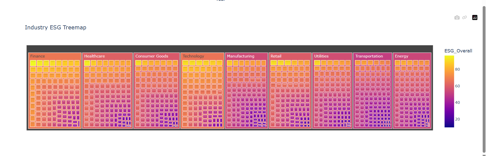
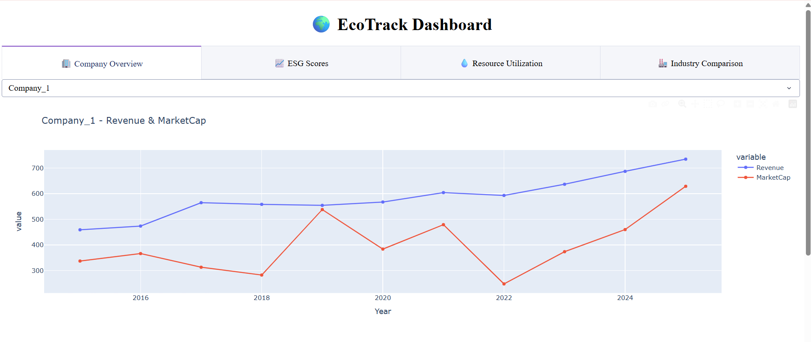
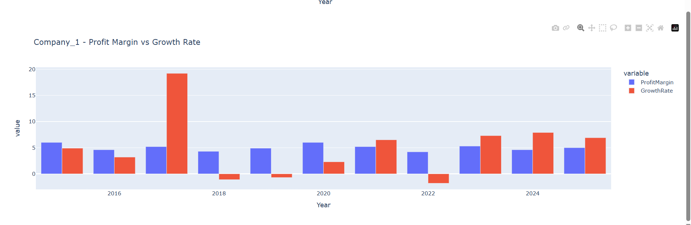
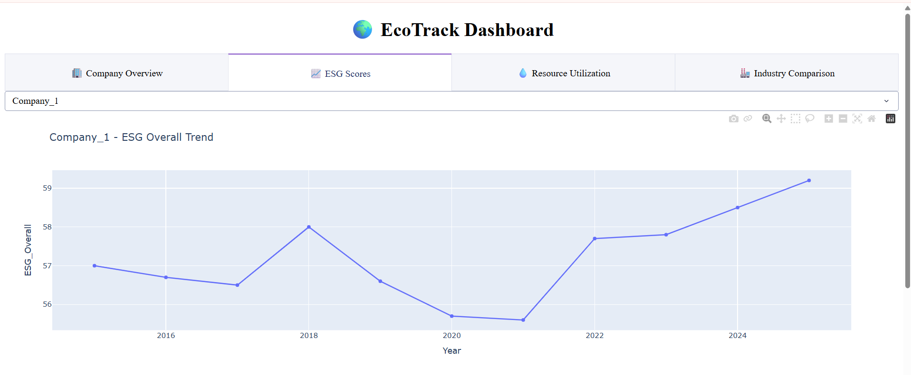
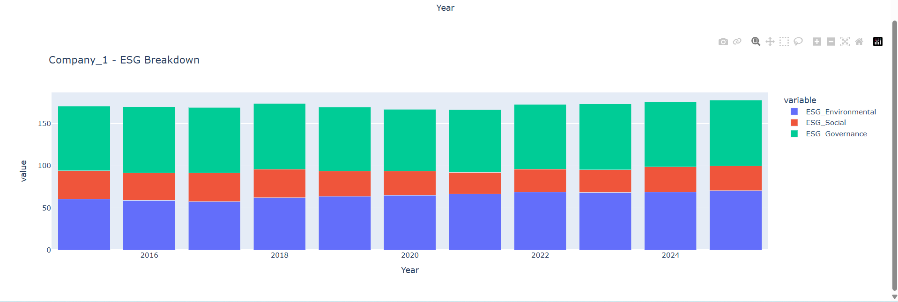
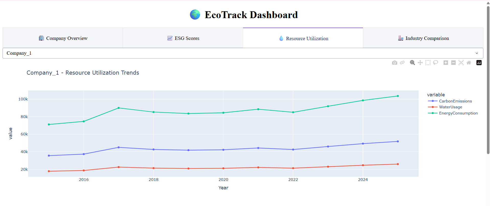
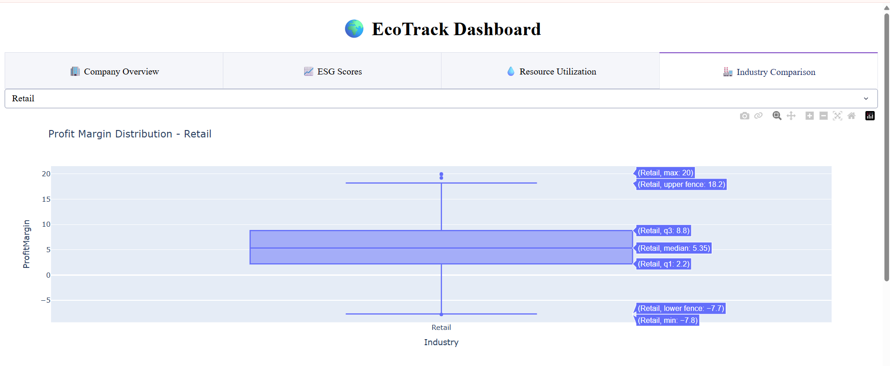
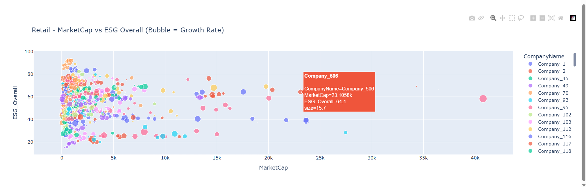

# 🌍 EcoTrack — ESG & Financial Analytics Dashboard

An interactive dashboard for exploring the relationship between corporate ESG
performance and financial outcomes across 1,000 companies, 9 industries and
7 regions over an 11-year period (2015–2025).

Built with Dash, Plotly and pandas. Deployed on Render.

**🔗 Live demo: [eco-track-8w84.onrender.com](https://eco-track-8w84.onrender.com)**

> ⏳ Hosted on a free instance that sleeps after inactivity. The first load may
> take 30–60 seconds to wake the server. Subsequent interactions are instant.



---

## Contents

- [What it does](#what-it-does)
- [Dataset](#dataset)
- [Features](#features)
- [Tech stack](#tech-stack)
- [Project structure](#project-structure)
- [Running locally](#running-locally)
- [Deployment](#deployment)
- [Scope and limitations](#scope-and-limitations)
- [Roadmap](#roadmap)

---

## What it does

ESG reporting produces a lot of numbers and very little comparability. A company's
raw carbon figure means nothing without knowing its size, its sector, and how its
peers are moving. EcoTrack pulls financial performance, ESG scores and
environmental resource consumption into a single interface so that all three can
be read against each other rather than in isolation.

The dashboard is organised into four analytical views, each answering a different
question:

| View | Question it answers |
|---|---|
| Company Overview | How has this company performed financially over time? |
| ESG Scores | How has its ESG profile changed, and which pillar drives it? |
| Resource Utilization | What does it consume, and where does it sit among peers? |
| Industry Comparison | How is profitability distributed within a sector, and does market value track ESG? |

---

## Dataset

11,000 rows × 16 columns. A balanced panel: every one of the 1,000 companies has
exactly one record per year from 2015 to 2025, with industry and region held
constant per company.

**Identifiers & dimensions**

| Field | Description |
|---|---|
| `CompanyID`, `CompanyName` | Company identifier (1–1000) |
| `Industry` | One of 9 sectors |
| `Region` | One of 7 global regions |
| `Year` | 2015–2025 |

**Financial measures**

| Field | Description |
|---|---|
| `Revenue` | Annual revenue |
| `ProfitMargin` | Net margin, % |
| `MarketCap` | Market capitalisation |
| `GrowthRate` | Year-on-year growth, % |

**ESG measures**

| Field | Description |
|---|---|
| `ESG_Overall` | Composite score, 0–100 |
| `ESG_Environmental` | Environmental pillar, 0–100 |
| `ESG_Social` | Social pillar, 0–100 |
| `ESG_Governance` | Governance pillar, 0–100 |

**Environmental measures**

| Field | Description |
|---|---|
| `CarbonEmissions` | Absolute carbon output |
| `WaterUsage` | Absolute water consumption |
| `EnergyConsumption` | Absolute energy consumption |

The preprocessing stage (`scripts/data_preprocessing.py`) removes duplicates and
imputes missing values — median for numeric fields, mode for categorical — writing
a clean table to `cleaned_data/`. The cleaned dataset contains no nulls.

---

## Features

### 🏢 Company Overview

Revenue and market capitalisation plotted together on a shared time axis, with
profit margin and growth rate shown as grouped bars underneath. Splitting the two
financial pairs keeps the scale readable, since revenue and market cap differ by
orders of magnitude from the percentage measures.





### 📈 ESG Scores

The composite ESG trend line shows direction of travel; the stacked pillar
breakdown underneath shows what is driving it. A company can hold a flat overall
score while its environmental and governance pillars move in opposite directions,
which the composite alone would hide.





### 💧 Resource Utilization

Carbon, water and energy consumption plotted over time for the selected company,
paired with a treemap of the full 1,000-company universe hierarchically nested by
industry and shaded by mean ESG score. The treemap provides the peer context that
the single-company trend line lacks.




### 🏭 Industry Comparison

A box plot of profit margin distribution within the selected sector, exposing
spread and outliers rather than just the average. Alongside it, a bubble chart of
market capitalisation against ESG score, with bubble size encoding growth rate —
a three-variable view of whether the market rewards ESG performance within a sector.





---

## Tech stack

| Layer | Technology |
|---|---|
| Application | Dash 4.4 |
| Visualisation | Plotly Express 7.0 |
| Data processing | pandas 3.0 |
| EDA | Matplotlib, Seaborn |
| WSGI server | Gunicorn 26.2 |
| Hosting | Render (free tier) |
| Runtime | Python 3.14 |

---

## Project structure

```
ECO-TRACK/
├── data/
│   └── company_esg_financial_dataset.csv   # Raw dataset
├── cleaned_data/
│   └── cleaned_dataset.csv                 # Deduplicated, imputed
├── scripts/
│   ├── data_preprocessing.py               # Cleaning pipeline
│   ├── eda_analysis.py                     # Exploratory analysis
│   └── dashboard_app.py                    # Dash application
├── assets/                                 # Screenshots
├── requirements.txt
└── README.md
```

---

## Running locally

```bash
git clone https://github.com/sakshiroy2026/ECO-TRACK.git
cd ECO-TRACK

python -m venv venv
source venv/bin/activate        # Windows: venv\Scripts\activate

pip install -r requirements.txt
python scripts/dashboard_app.py
```

The app starts at `http://127.0.0.1:8050`.

To regenerate the cleaned dataset from the raw source:

```bash
python scripts/data_preprocessing.py
```

---

## Deployment

Deployed to Render as a Python web service. Two details matter for reproducing it:

**Gunicorn needs the Flask server object, not the Dash app.** Dash wraps a Flask
instance, exposed in `dashboard_app.py` as `server = app.server`. Gunicorn is
pointed at that object rather than at the Dash wrapper.

**The start command binds explicitly to the platform's assigned port.** Running
`python dashboard_app.py` in production would bind to `127.0.0.1:8050`, which the
platform cannot route to, causing the deploy to fail its port scan.

| Setting | Value |
|---|---|
| Build command | `pip install -r requirements.txt` |
| Start command | `gunicorn scripts.dashboard_app:server --bind 0.0.0.0:$PORT` |
| Root directory | *(blank — keeps relative data paths valid)* |

Every push to `main` triggers an automatic rebuild and redeploy.

---

## Scope and limitations

Stated plainly, because these shape how the output should be read:

- **The dataset is synthetic.** Company names are generic identifiers. The data is
  structurally realistic and internally consistent — sector-level differences in
  ESG and emissions behave as you would expect — but no conclusion here describes
  a real firm.
- **Absolute environmental figures are not comparable between companies.** A large
  company emits more than a small one regardless of efficiency. Meaningful
  cross-company comparison requires normalising by revenue, which this version
  does not do.
- **Observed ESG–financial associations are weak.** Across the full panel, ESG
  score correlates with profit margin at roughly *r* = 0.09 and with revenue at
  *r* = 0.15. These are weak positive associations and are not evidence of a
  causal relationship in either direction.
- **Company-level views are lookup tools, not analysis.** Three of the four tabs
  answer questions about one company at a time. Portfolio-level questions are only
  partially addressed by the Industry Comparison view.

---

## Roadmap

- Normalise environmental measures by revenue to produce carbon, water and energy
  **intensity** metrics, enabling like-for-like comparison across company sizes
- Add portfolio-level views: ESG trajectory by industry, regional heat matrix,
  largest movers over the period
- Server-side caching of aggregate computations to cut cold-start latency
- Recreate the core analytical views in Power BI with a star-schema model and DAX
  measures

---

## Author

**Sakshi Roy** — B.Tech Computer Science & Engineering (AI), IGDTUW

[GitHub](https://github.com/sakshiroy2026) · [LinkedIn](https://linkedin.com/in/YOUR-LINKEDIN-HANDLE)
